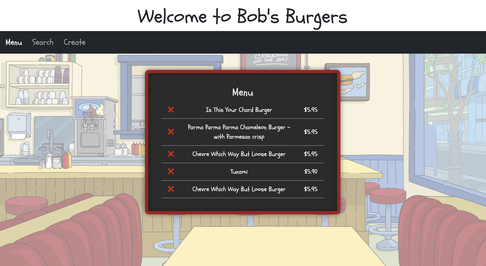

# Bob's Burger of the Day Menu

A fun React single page application for those who love the TV show "Bob's Burgers"! View, search, save and create Daily Burger Specials. This app utilizes the [The Bob's Burgers API](https://www.bobsburgersapi.com/) to fetch burgers and a JSON file to store saved and created burgers.

## Features

- View a Menu Board of current Burger Specials
- Search for Burgers by name
- Save Burgers to the Menu Board
- Create your own Burger
- Delete Burgers off the Menu Board

## Screenshots

## Deployed App

This app has been deployed with [Render](https://render.com/) and can be viewed here:

- [Bob's Burgers of the Day Menu](https://bobs-burgers-of-the-day.onrender.com/)

## Set Up

To run this App locally, you will need to:

- Clone the Repo
- Run `npm install` to install dependencies
- Run `npm json-server --watch db.json` to start the JSON server.
- Run `npm start` to start the front-end
- This will open the app in your browser at http://localhost:3001

Please Note: Make sure fetch requests match the backend address:

`fetch("http://localhost:3001/burgers/")`

## Dependencies

This project relies on the following dependencies:

- **React** – Core frontend library
- **React Router DOM** – Client-side routing
- **Bootstrap** – Styling and layout
- **JSON Server** – Mock API for local data persistence

## Credits

This app was created by Jen Kelly.
